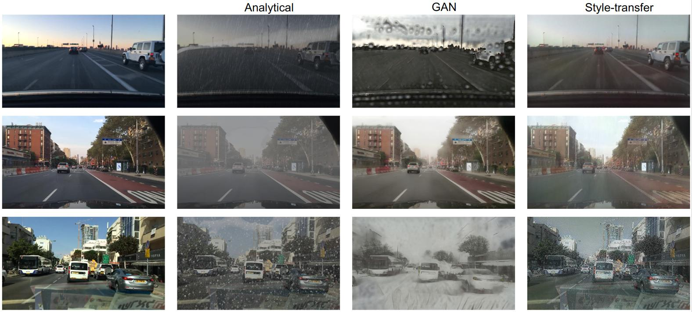

# UAV-based Real-time Vehicles Detection


## I. Introduction

Within this project, we would like to deploy a pipeline to continuously detect vehicles (car, truck, bus) within video 
frames sent from simulated Unmanned Aerial Vehicles (UAVs). 

Each UAV, as producer, continuously captures and sends video frames to Kafka Streaming. As this concept requires to
process a huge amount of data and address real-time challenges, we utilize Spark Distributed Deep Learning for detecting
bounding boxes of vehicles and Spark Structured Streaming to read and write stream data. The end point of data is Kafka 
output sink, and we use consumers to load that stream data out.

## II. Dataset

We decided to use [UAVDT Benchmark](https://sites.google.com/view/grli-uavdt/%E9%A6%96%E9%A1%B5)
dataset for our simulation and training stage. The distribution of the dataset is shown below.


## III. Model

We have chosen YOLO (You Only Look Once) as the primary solution for our approach due to the system's need for both real
-time constraints and high accuracy, with a higher priority on the former. Specifically, we are utilizing YOLOv5n for 
our detection tasks. Additionally, we have included other YOLO models, such as YOLOv8s and YOLOv8n, to enable a more 
comprehensive and accurate comparison.


For the weather generator, we used CycleGan at [here](https://github.com/hgupta01/Weather_Effect_Generator)



## IV. Workflow


## V. Setup

The repo is developed on Ubuntu 22.04. Make sure to get the compatible packages and prerequisites if you try to run this
on Windows. Also, be careful with OS-related errors or warnings.

### Prerequisites

- Python 3.10
- [Spark 3.5.1](https://downloads.apache.org/spark/spark-3.5.1/spark-3.5.1-bin-hadoop3.tgz)
- [Kafka 3.7.1 - 2.12(Scala)](https://downloads.apache.org/kafka/3.7.1/kafka_2.12-3.7.1.tgz)

We configured 5 partitions for Kafka. Write down the path to Kafka for later setup.

### Steps to deploy

**1. Install packages and setup environment**

- You can replace command lines within `start.sh` to below code and use `bash start.sh` to start the zookeeper and kafka
server
```bash
/path/to/your/kafka/bin/zookeeper-server-start.sh /path/to/your/kafka/config/zookeeper.properties |
/path/to/your/kafka/bin/kafka-server-start.sh  /path/to/your/kafka/config/server.properties
```
- Try to use virtual env in Python for better development stage.
```bash
# Install python libraries and dependencies
pip install -r requirements.txt

# Create a directory to store the data
mkdir data
```
- Download UAVDT Benchmark dataset [here](https://drive.google.com/file/d/1m8KA6oPIRK_Iwt9TYFquC87vBc_8wRVc/view). Put 
it within the created `data/` folder, then extract it out.

**2. Start files**

- Firstly, run the `main/app/streaming_app.py` file to start Flask app
```bash
python main/app/streaming_app.py
```
- Secondly, run the `main/spark_streaming.py` file to start Spark Structured Streaming query writer
```bash
python main/spark_streaming.py
```
- Finally, run the 3 producers within `main/producers`. We wanted to simulate weather rainy situation in `producer_3.py`.
You can try it by running `Weather_Effect_Generator/CyclicGAN.py` with the configurable `set_weather` and
`folder_weather` variables  in `_constants.py`, then change the `image_folder` in it to `folder_weather`.

### Interfaces

- http://localhost:5000: Flask app
- http://localhost:4040: Spark UI

